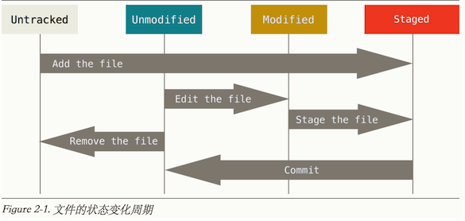

# 基础

##1 Git的优势

1. `SVN`和`Git`,因为`SVN`要是主机挂了.所有记录都GG了.而`Git`是分布式的.而且`Git`平台比较多,`GitLab`,`coding.net`,`GitHab`等等

2. `Git`可以现在本地执行,可以在本地进行`commit`,而`SVN`每次`commit`都必须是提交到主机.(虽然笔者推荐多push,但是可以本地`commit`有时也是不错的,主要是保证本地能有备份)
3. `Git`能保证数据完整性,Git中所有数据在存储前都计算校验和,然后以校验来引用,所以你在传送过程中丢失文件,Git都知道(笔者试过一个push断了4次,但是最后还是每次增量的提交了上去.)

##2. Git和SVN存储方式的不同

SVN :

Git :

注意`Git`的存储图中,外面有间隔线的表明数据没有变化,存的只是索引.

SVN是差异比较,每个版本的文件依赖于上一个版本.

Git的每个版本的文件是独立存在的,是直接记录快照.

##3. Git的三个工作区域和三种状态

三个工作区域 :

1. 工作目录 : 我们从Git仓库提取出来的文件,正在本地修改的目录
2. 暂存区域 : 是一个文件,保存下次将要提交的文件信息列表
3. Git仓库  : 保存项目元数据和对象数据库的地方

三种状态:

1. 已提交 : 如果Git仓库保存着特定版本文件,就属于已提交状态
2. 已修改 : 自上一次取出来修改了,但还没放入暂存区(commit)
3. 已暂存 : 如果作了修改并放入暂存区域(commit),就属于已暂存. 

其实还有二种形式可分
1. 未跟踪 : 在本地未`git add`的就是未跟踪的.
2. 已跟踪 : 上述三种状态都是已跟踪状态.

##4. 安装Git

    //ubuntu
    apt-get install git
    
其他版本系统 :<http://git-scm.com/downloads>   

##5. Git配置

1. 全局系统配置 : `/etc/gitconfig` git config --system ...
2. 用户`~/.gitconfig` or `~/.config/git/config` git config --global ...
3. 当前项目 : ./git/config

一开始设置用户名和邮箱

    $ git config --global user.name "404_K"
    $ git config --global user.email 404_K@example.com
    
详情输入`git config`查看 or `git help config`

##6 获取Git仓库

1. 初始化仓库

    1. git init : 创建.git目录初始化git
    2. git add . 添加当前目录到git中.
    3. git commit -m "first commit" 放入暂存区中.
2. 克隆现有仓库

    `git clone https://github.com/mzkmzk/Read.git [重命名本地目录]
`

##7 Git 基础

