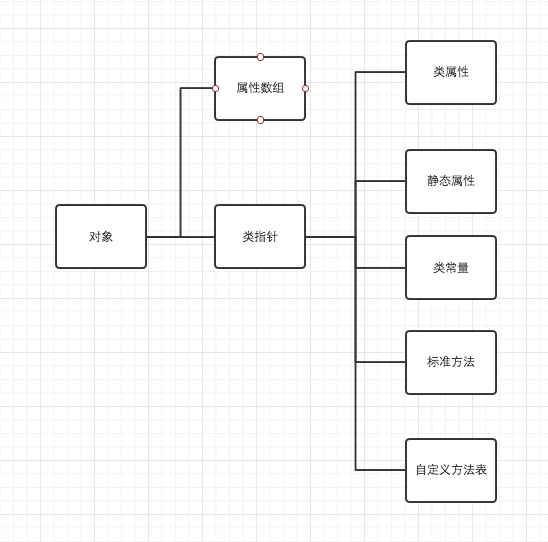

# PHP核心技术与最佳实践

##1. 面向对象思想的核心概念

###1.1 源码定义变量和对象

变量源码定义:

```c
#zend/zend.h
typedef union_zvalue_value{
    long lval;/*long value*/
    double dval; /* double value */
    struct {
        char *val;
        int len;
    };
    HashTable *ht ; /* hash table value*/
    zend_object_value obj;
}zvalue_value;
```

对象源码定义:

```c
#zend/zend.h
typedef struct_zend_object {
    zend_class_entry *ce;//类的入口
    HashTable *properties; //属性组成的HashTable
    HashTable *guards;/*防止递归调用的 protects from __get/__set ...recursion */
}zend_object
```

对象的组成:



###1.2 对象和数组

序列化后对象和数组的区别

```php
//对象
$str = serialize($student);
    0:6:"Student":2:{s:4:"name";s:3:"Tom";s:6:"gender";s:"mail";}

$student_arr = array("name"=>"Tom","gender"=>"male");

//数组
$str_arr = serialize($student_arr);
     a:2:{s:4:"name";s:3:"Tom";s:6:"gender";s:"mail";}
```

序列化后,对象和数组的区别只是对象多一个指针指向它所属的类.

##2. PHP与数据库

###2.1 SQL基本优化

1. 避免在列上,会导致索引失败

    ```sql
    select * from t where year(d) >=2011;
    
    //优化为
    select  * from t where d > = '2011-01-01';
    ```
2. 使用JOIN时,应该用小结果集驱动大结果集,同时把复杂的JOIN查询拆分为多个Query,因为JOIN多个表,可能导致更多的锁定和堵塞.
    
    ```sql
    select * from a join on a.id = b.id
    left join c on c.time = a.date
    left join d on c.pid = b.aid
    left join e on e.cid = a.did
    ```
3. 模糊like查询,避免%%

    ```sql
    select * from t where name like = '%de%';
    
    //优化为: 但是中文就不知道怎么玩了......
    select  * from t where name > = 'de' and name < 'df';
    ```
4. 仅列出所需的查询字段,少用*号,对速度不会有明显影响,但会影响内存.
5. 使用批量插入语句节省交互.
6. limit的基数比较大的使用使用between.

    ```sql
    select * from t order by id limit 1000000,10;
    
    //优化为
    select * from t where id between 1000000 and 1000010 order by id;
    ```
    
    但是between也有缺陷,如果id中间有断行,或者中间部分id不读取的话,总读取的数量会少于预计数量,在取比较厚的数据用desc方向查找.
7. 避免使用NULL
8. 不要使用count(id),而是count(*)
9. 不要做无谓排序,应该在索引时中完成排序.

