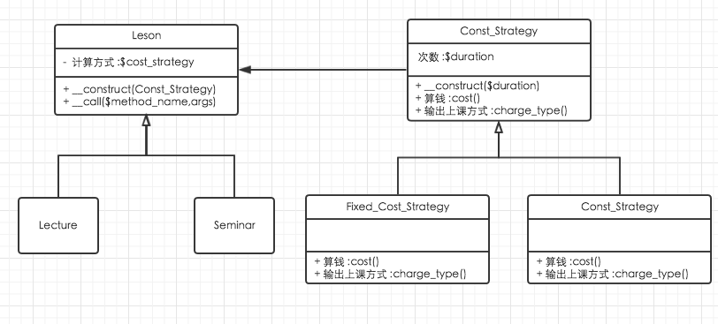
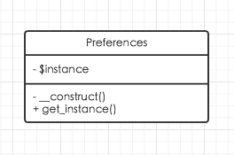
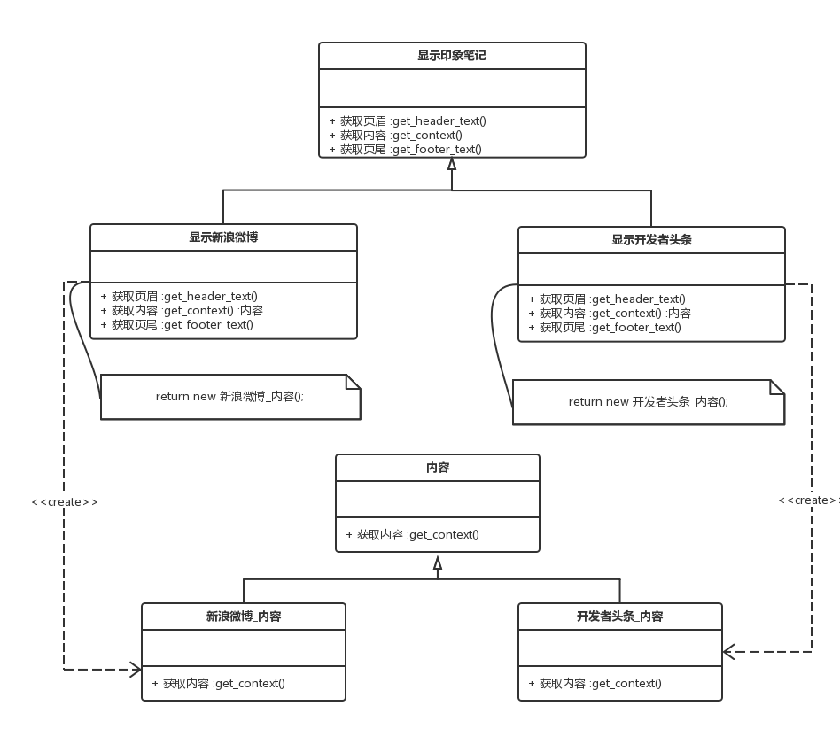
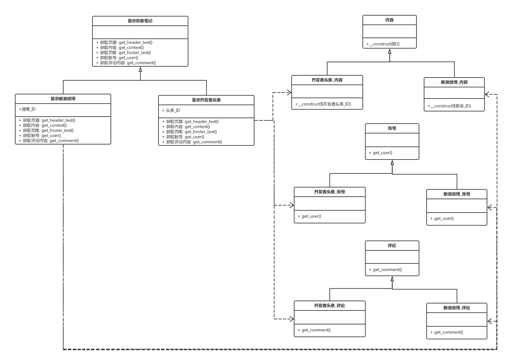
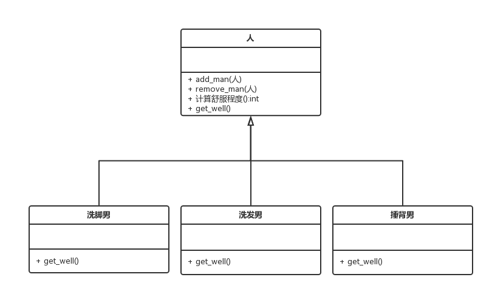
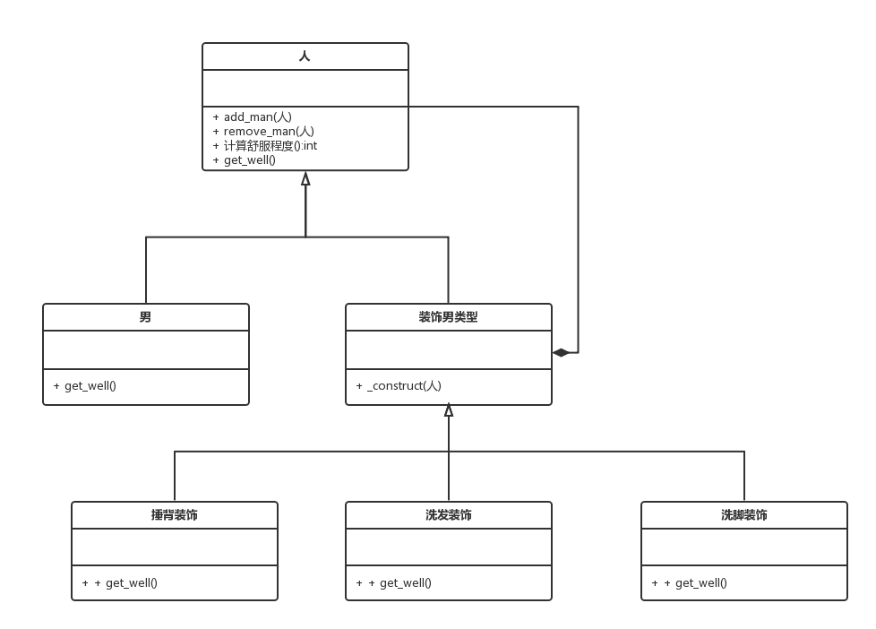
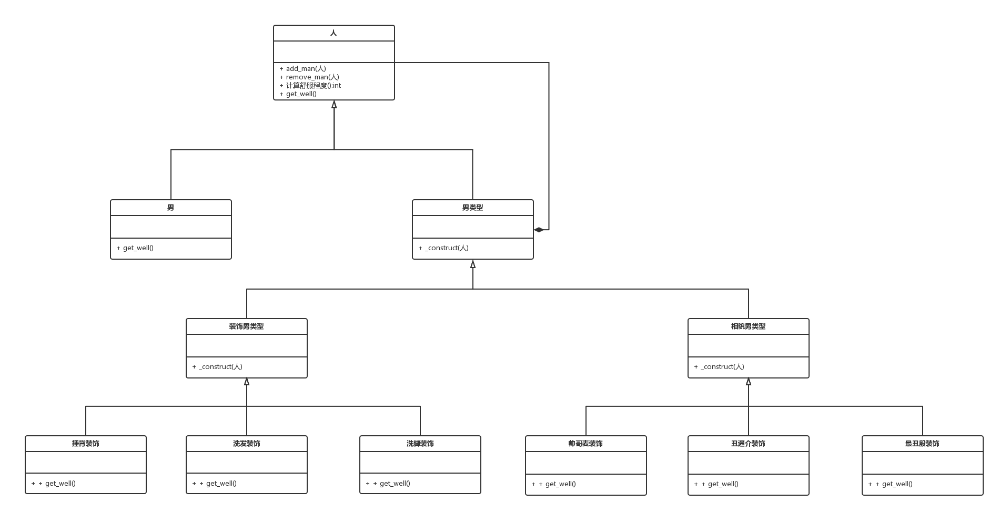
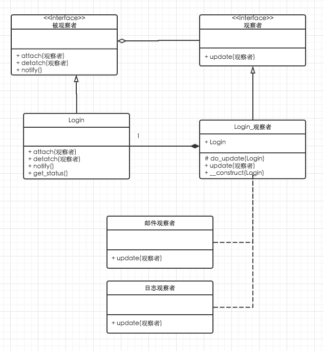

# 深入php面向对象、模式与实践

#1 语法

##1.1 基础语法

1. `clone`

	需要操作原对象,但又不想影响原对象.

		$K_back = clone $K;
		
	基本数据类型和数组都为真复制,即为真副本,当属性为对象时,为假复制,改变副本仍会影响原对象.解决方案:
	
		//在原对象中添加
		function __clone(){
			$this->对象 = clone $this->对象
		}	
		
	`__clone`在clone前自动触发,可以执行一些在备份前的属性操作.	
	
2. `&`传递引用	

	方法引用传递,改变源对象
		
		function set_K(& $K){...}
		
		function & get_K(){...}
		
3. `static`延迟静态绑定

	应用场景:Dog类和Person类都需要一个返回实例化的方法,Dog类和Person类都继承于Animal抽象类.
	
		abstract class Animal{
			public static function create(){
				//实例化调用类
				return new static();
			}
		}
		
		class Person extends Animal{...}
		
		//返回Person实例化类
		Person::create();
		
4. `拦截器`

	1. `__get($property)`,访问未定义的属性时调用.
	
	2. `__set($property,$value)`,给未定义的属性赋值时被调用.
	
	3. `__isset($property)`,对未定义属性调用isset()方法时调用.
	
	4. `__unset($property)`,对未定义属性调用unset()方法时调用.
	
	5. `__call($method,$arg_array)`,调用未定义方法时调用.
	
		__call很有用,但要慎用,因为太灵活.
		
		应用场景:有一个专门打印Person类信息的Person_Writer类,如果通过Person类调用Person_Writer类.
		
			//Person委托Person_Writer类处理打印事务.
			class Person {
				private $writer;
				...
				
				function __call($method_name,$args){
					if(methood_exists($this->wirter,$method_name)){
						return $this->writer->$method_name($this);
					}
				}
				
				//高级__call写法,当委托方法参数不确定时使用.
				function __call($method_name,$args){
					//当然这里这样写法意义不大,但是call一般都是用call_user_func_array调用
					$args = $this ;
					if(methood_exists($this->wirter,$method_name)){
						return call_user_func_array(
							array($this->writer,$method_name),$args);
						)
					}
				}
				
			}		

5. `回调函数`

	应用场景:	3个类,`Product类`,`Product_Sale类`,`Product_Totalizer类`,要实现:当卖出Product总共价格超过指定金额时,输出警告.
	
		//Product
		class Product {
			public $name;
			public $price;
		}
		
		//Product_Sale
		class Product_Sale {
			private $callbacks;
			
			//记录回调函数
			function register_callback ($callback) {
				if(! is_callback($callback)){
					thow new Exception('callback not callable');
				}
				$this->callbacks[] = $callback;
			}
			
			//执行回调函数
			function sale ($product){
				print "{$product->name} : 处理中 \n";
				foreach($this->callbacks as $callback){
					call_user_func($callback , $product);
				}
			}
		}
		
		//Produce_Totalizer
		class Produce_Totalizer {
			static function warn_amount ($amt) {
				$count = 0;
				return function ($produce) use ($amt , &count) {
					$count += $produce->price;
					print " count : {count}\n"
					if($count>$amt){
						print "超过指定金额{$amt}啦~";
					}
				};
			}
		}
		
		//模拟场景
		$product_sale = new Produce_Sale();
		//指定报警金额为8块
		$product_sale = register_callback(Product_Titakuzer::warn_amount(8)); 
		
		//卖商品
		$product_sale->sale(new Product("Durex",6));
		$product_sale->sale(new Produce("Jissbon",5));
		
		//输出结果
		Durex : 处理中
			count :6 
			
		Jissbon : 处理中	
			count: 11
		
		超过指定金额8块啦~
		
6. `get_class()`和`instanceof`

	`get_class(类)`用于判断是否精准等于类名;
	
	`instanceof` 可以判断是否其本身或继承于某父类.
	
7. 类中的方法和类中的属性

	`get_class_methods('类名')`:获取类中所有方法.
	
	`get_class_vars('类名')`:获取类中所有public参数;		
8. 反射API

#2 模式 

##2.1 组合

问题:课堂类被演讲类和研讨会类继承着.但是演讲类和研讨类都要实现一次性计费和上N次课计费的方法.和输出计算的方式.

解决方案1: 在课堂类中添加计算一次性付费的方法,上N次课的计费方法和输出计算方式的方法.

解决方案2: 运用组合,将处理计费和输出计算方式单独封装为一个计费策略类.


	abstract class Cost_Strategy {
		protected $duration;
		abstract function cost ();
		abstract function charge_type();
		
		public __construct($duration){
			$this->duration = $duration;
		}
	}
	
	class Timed_Const_Strategy extends Cost_Stratedy {
		function cost () {
			//上一次课给5块钱- -.
			return $this->duration * 5;
		}
		
		function charge_type(){
			return "多次课结算";
		}
	}
	
	class Fixed_Const_Strategy extends Cost_Stratedy {
		function cost (){
			return 30 ;
		}
		
		function charge_type(){
			return "一次性课结算";
		}
	}
	
	abstract class Leason {
	
		private $cost_strategy;
		
		public __construct(Const_Strategy $cost_strategy){
			$this->cost_strategy = $cost_strategy;
		}
		
		function __call($method_name,$args){
			$args = $cost_strategy ;
			if(methood_exists($this->cost_strategy,$method_name)){
				return call_user_func_array(
					array($this->writer,$method_name),$args);
				)
			}
		}
	}
	
	//运用
	$leasons[] = new Seminar(new Timed_Const_Strategy(4));
	$leasons[] = new Lecture(new Fixed_Const_Strategy(null));
	
	foreach ($leasons as $leason){
		print "leason charge : {$leason->const()}";
		print "charge_type : {$leason->charge_type()}"
	}
	
	leason charge 20. charge_type : 多次课结算;
	leason charge 30. charge_type : 一次课结算;
		
组合既委托.同级委托.

继承既父子关系.

#3 生成对象

##3.1 单例模式

确保系统中只有唯一一个用例.例如系统配置文件.

重点 

1: 构造方法私有.

2: 类本身包含自己的实例化属性.



	class Preferences {
		private static $instance;
		private function __construct(){ ... }
		
		public static function get_instance(){
			if(empty(self::$instance)){
				self::$instance = new Preferences();
			}
			return self::$instance;
		}
		...
	}
	
	//使用
	$preferences = Preferences::get_instance();
	
##3.2 工厂模式

通过一个父类,生产处多个不同功能的子类.

特点:产品方(新浪微博)和需求方(显示新浪微博)一一对应.

问题:印象笔记中,来源可能为新浪微博,或者开发者头条,在印象笔记显示的时候,两者的页眉和页尾是不一样的.



##3.3 抽象模式				

RLGL!!!.印象笔记不只要显示新浪微博内容!!!还要显示我的新浪账号,还要该微博啊~~!!卧槽~~~憋着急,吻我.

工厂模式主要用于生产一一对应的产品方和需求方,而抽象模式要做的是一个需求方(印象笔记_显示新浪微博),要多个工厂(把需求方抽象为多个需求方),例如提供新浪内容的工厂,提供新浪账号的工厂.提供微博内容的评论的工厂等.



代码: 

	abstract class Show_Evernote {
		abstract function get_header_text();
		abstract function get_context();
		abstract function get_footer_text();
		abstract function get_user();
		abstract function get_comment();
		
	}
	
	class 显示新浪微博 extends Show_Evernote{
		function get_header_text(){...};
		function get_context(){new 新浪微博_内容;}
		function get_footer_text(){...};
		function get_user(){new 新浪微博_账号 ;}
		function get_comment(){new 新浪微博_评论;}
	}
	
	//使用
	印象笔记控件类->内容 = 显示新浪微博->get_context;
	印象笔记控件类->账号 = 显示新浪微博->get_context;
	...

##3.4 平行模式

当使用工厂/抽象模式必须要制定具体的创建者(需求方).

平行模式和抽象模式的模型图一致,但代码实现不一样.

抽象模式中父类均为抽象类,而平行模式中,所以类都为普通类,方便父类的实例化.

在这里列出显示印象笔记类的实现代码

	class Show_Evernote{
		private $内容;
		private $账号;
		private $评论;
		
		function __construct(内容,账号,评论){
			$this->内容 = 内容;
			$this->账号 = 账号;
			$this->评论 = 评论;
		}
		
		function get_内容(){
			return clone $this->内容);
		}
		
		function get_账号(){
			return clone $this->账号);
		}
		
		function get_评论(){
			return clone $this->评论;
		}
	}
	
	//使用
	$factory = new Show_Evernote( 
		new 新浪微博内容(),
		new 新浪微博账号(),
		new 新浪微博评论()
	);
	
	印象笔记控件类->显示印象笔记 = $factory;
	
其实大家可以发现,原型模式只不过只在最顶层类中包装了一下各组件子类而已,然而这样可以轻松的组合他们,例如实现一个显示新浪微博内容,但要显示开发者头条账号的需求?


#4 使用对象

##4.1 组合模式

组合模式,可以理解为单一对象管理组合对象(聚合组件),最终组合体下的各个组合部件最好类型一致.不然特殊性越多,需要判断就越多.

假设捶背男,洗脚男,洗发男,用来服务一个人(妹子).

假设妹子的几个部位可用的服务男均为无限个.


	//创建一个妹子
	$妹子 = new 男();
	
	//添加洗脚男、捶背男
	$妹子->add_man(new 洗脚男);
	$妹子->add_man(new 捶背男);
	
	//循环所有男的给予舒服的方法.
	$妹子->计算舒服程度();
	
这是一个很理想的组合模式,在现实情况,我们使用组合模式,可能不得不创建多种类型的洗脚男,需要添加许多判断条件.

##4.2 装饰模式

装饰模式,首先洗脚男,洗发男,捶背男都是人,但是如果,一个男的又捶背,又洗发,这怎么玩?.`add_man`两次?这不科学吧,来给这些男的装饰一下吧~



	abstract class 人{
		...
		abstract function get_well();
	}	
	
	class 男 extends 人 {
		//无论你是神马男,服务你,你就能获得10点舒服度.
		private $well = 10;
		function get_well(){
			return $this->well();
		}
	}
	
	abstract class 装饰男类型 extends 人 {
		protected $人;
		function __construct(人 $人){
			$this->人 = $人;
		} 
	}
	
	class 捶背装饰 extends 类型男装饰{
		function get_well(){
			return $this->人->get_well()+30;
		}
	}
	
	class 洗发装饰 extends 类型男装饰{
		function get_well(){
			return $this->人->get_well()+20;
		}
	}
	
	class 洗褪装饰 extends 类型男装饰{
		//老子不喜欢别人碰我的毛裤.
		function get_well(){
			return $this->人->get_well()-20;
		}
	}
	
	//创建捶背,能给予的舒服指数 - -嘻嘻.
	$人 = new 捶背装饰(new 男);
	$人->get_well(); // 10+30 = 40
	
	//来来来,全能选手,捶背、洗发、洗腿一起来
	$人 = new 洗脚装饰(new 洗发装饰(new 捶背装饰(new 男()))); //10+30+20-20 = 40,注意顺序,由里到外执行.
	
装饰模式,既(组合+继承),基类方法一定要尽量少,不然子类可能有它不该有的方法.直接类继承,她只可能是一种形态,而她的多种形态可能一并拥有的时候,应该运用组合.

继承即单一多态,组合既多种多态.	

这个例子中,你可以添加女,然后把装饰男类型改为装饰通用类型,但每个get_well()都要多一个判断是男还是女(如果给予的舒服程度不一样).

这只是确保不可能出现在`男`,`女`之外的第三种人,如果基类为动物,给予服务的可能是鸡,鹅,鸭,那么装饰类型应该运用工厂模式,动物形态和装饰形态一一对应.方便拓展.

除了服务类型,服务男的样子也很重要,这就多了一种装饰,现在有`装饰男类型`和`相貌男类型`,这种情况怎么破,其实类似.



	//如何获取捶背的帅哥麦?,
	$人 =new 男类型(new 捶背(new 帅哥麦(new 男())));
	
##4.3 外观模式

即给外部系统提供清晰接口

例如当Model层写得很混乱,但是里面的方法还能用,那我们的Controller层应该列举一些清晰的访问方法来供View层访问.外观模式,强调的是清晰的访问接口.
	
#5 执行任务

##5.1 策略模式

给类添加功能.对象要显式的调用它.

继续刚才的洗脚男和人的故事吧...你丫的爽完了要给钱吧?支付宝?微信?现金?

这个付款方式有多种,实现方法不应该放在`人`类中,而是应该委托给别的类

	abstract class 人 {
		
		protectd $支付方式;
		
		function set_支付方式(){...}
		
		function 付款(金额){
			return $支付方式->付款($金额);
		}
	}
	
	abstract class 付款{
		abstract function 付款($金额);
	}

	class 支付宝付款 extends 付款{
		
		function 付款($金额){
			return 外接支付宝付款流程($金额);
		}
	}
	...
	
	//使用
	$男 =new 男();
	
	///爽爽爽
	...
	
	//结账
	$支付宝支付账单 = new 支付宝付款($金额);
	$人 = new 男();
	$人->set_支付方式(new 支付宝付款());
	$人->付款();
	
##5.2 观察者模式

当被观察者发生变化,观察者需要被通知.

当数据发生变化,页面需要被通知.

使用步骤:

1. 观察者加载到被观察者中.
2. 被观察者通知观察者.



例如登陆类(被观察)状态改变,要出发邮件系统和日志系统(观察者)

	interface 被观察者{
		function attach(观察者);
		function detatch(观察者);
		function notify();
	}
	
	class Login implements 被观察者{
		private $观察者;
		
		function __construct(){
			$this->观察者 = array();
		}
		
		function attach($观察者){
			$this->观察者 = $观察者; 
		}
		
		function detach($观察者){
			//删除某个观察者的操作;
		}
		
		function notify(){
			foreach ($this->观察者 as $单个观察者){
				$单个观察者->update($this);
			}
		}		
	}
	
	interface 观察者{
		function update(被观察者);
	}
	
	abstract class Login_观察者 implements 观察者{
		private $login;
		function __construct (Login $login){
			$this->login = $login;
			$login->attach($this);
		}
		
		function update(观察者 $观察者){
			if ($观察者 ===$this->login){
				$this->do_update($观察者);
			}
		}
		abstract function do_update(Login $login);
	}
	
	class 邮件观察者 extends 登陆观察者 {
		function do_update(Login $login){
			//判断条件 发送邮件
		}
	}
	
	
	class 日志观察者 extends 登陆观察者 {
		function do_update(Login $login){
			//判断条件 记录到日志;
		}
	}
	
	//使用
	$login = new Login();
	new 邮件观察者 ($login);
	new 日志观察者 ($login);
	
PHP有内置的SPL实现上述的观察者模式.	

##5.3 访问者模式

问题: 在一个军队中,有很多军队,军队下面可能包含军队/步兵/弓箭手,这时我们要统计一个军队的战斗力/需要总粮食?.怎么办?.解决办法是军队还是保存自己的基本信息,设置一个访问者,访问者包含总战斗力方法和总粮食的方法.

访问者
```php
//这里重复定义了大量代码,其实可以用call来替代
abstract class 军队访问者{
    abstract function 访问(单元);
    
    function 访问弓箭手($弓箭手){
        $this->visit($弓箭手);
    }
    
}

class 军队战斗力访问者 extends 军队访问者{
    private $text="";
    
    function 访问($单元){
        $ret = "";
        $pad = 4*$单元->getDpth();
        $ret .= sprintf( "%{$pad}s","");
        $ret .= get_class($单元). ": ";
        $ret .= "战斗力: " .$单元->bombardStrenth()."\n";
        $this->text .=$ret;
    }
    
    function get_text(){
        return $this->text;
    }
}
```

被访问者
```php
abstract class 单元{
    function 接受($军队访问者){
        $method = "访问_".get_class($this);
        $军队访问者->$method($this);
    }
    
    private $depth;
    protected function set_depath($depth){
        $this->depth=$depth;
    }
    
    function get_depth(){
        return $this->depth;
    }
    ...
}

abstract class 综合单元 extends 单元{
    function 接受($军队访问者){
        parent::接受($军队访问者)
        foreach($this->单元集合 as $this_unit){
            $this->unit->接受($军队访问者);
        }
    }
}

```

调用
```php
$main_army = new Army();
$main_army->add_unit(new 步兵());
$main_army->add_unit(new 弓箭手());

$军队战斗力访问者_实例 =new 军队战斗力访问者();
$main_army->接受(均分战斗力访问者);
print $军队战斗力访问者->get_text();
```

输出
```php
军队: 战斗力: 50
    步兵: 攻击力 :48
    弓箭手: 攻击力: 4
```

