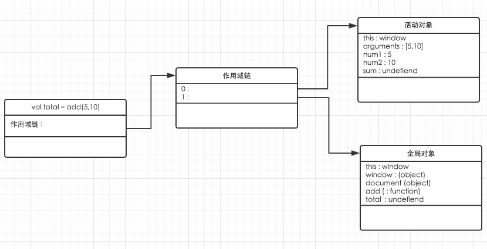

# 数据读取

##1. 数据类型:

1. 字面量 : 字面量只代表本身,不存储在特定的位置,包括字符串,数字,数组,函数,null,undefiend等.
2. 本地变量 : var 定义的数据存储单元;
3. 数组元素 : js数组对象内部,以数字作为索引
4. 对象成员 : 存储在js对象内部,以字符串为索引

##2. 作用域

###2.1 基本知识
每个函数可以理解为`Function`对象的一个实例,里面包含编程访问属性和一系列不能通过代码访问而仅供js引擎存取的内部属性,其中包含`[[Scope]]`

`[[Scope]]`包含一个函数被创建时的作用域中对象的集合.既`作用域链`

```javascript
function add (num1,num2){
    var sum = num1 +num2;
    return sum;
}

var total = add(5,10);
```

执行一个函数时,会创建一个执行环境(`独一无二,执行完就销魂`)

每个执行环境也有自己的作用域链,用于解析标识符

创建执行环境时,函数中的便利会顺序的复制到执行环境的作用域链中,称为`活动对象`,包含所有局部便利、命名参数、参数集合、`this`.



活动对象在作用域链的最顶端,每遇到一个变量就会经历`标识符`的解析

解析过程: 从顶端作用域查找同名标识符.

所以可以理出两个原理

1. 同名变量后者覆盖前者
2. 各作用域存在同名变量,只取最前面的变量.
3. 越底层的作用域中查找变量,耗时最多.所以当多次用到底端变量,用一个局部变量 = 底端变量.

###2.2 改变作用域链

改变作用域: `with` & `try-catch`

1. `with`

    ```javascript
    with(document){
        var links = getElementByTagName("a");
    }
        
    ```
    这时,局部变量所在的`活动对象`作用域链上多了一层,就是可变对象(这里是document),这样访问局部变量都变成了第二层,所以使用时慎重考虑.
2. `try-catch`

    当异常发生后,`catch`中异常对象就会在作用域链的第一层.
    
    所以如果在`catch`中执行过多的代码,会导致和`with`一样的错误
    
    寻找每个局部变量都要先通过`异常对象`,所以建议:
    推荐使用:
    
    ```javascript
    try{
        ...
    } catch(ex){
        handleError(ex);
    }
    ```
    这样只有一个局部变量,那样到了`handleError`函数中,异常对象`ex`会在我们的活动对象层中.
    ```


